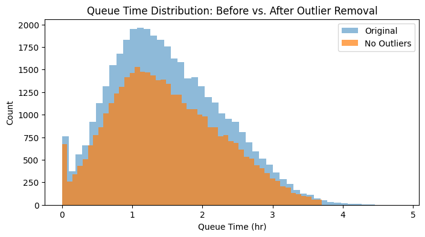
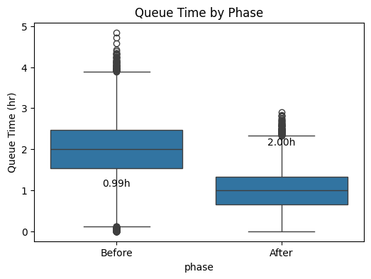
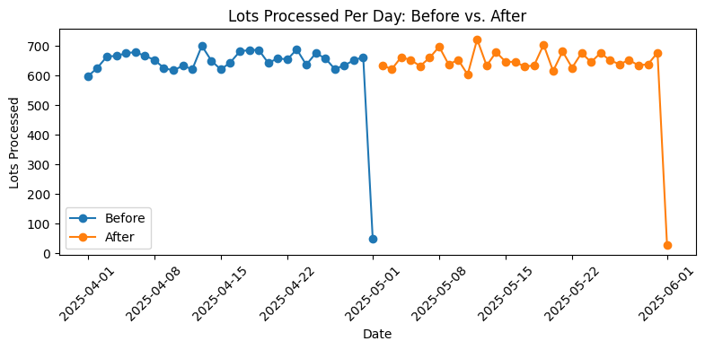

# Process Improvement Tracker

**Comparing queue times and throughput before vs. after adding capacity in a semiconductor fab**

---

## Executive Summary
- **Problem:** Long wait times (“queue time”) at a single etch tool slow down wafer production, increase WIP inventory, and drive up costs.  
- **Approach:**  
  1. Simulated two phases:  
     - **Before:** one tool, mean wait ≈ 2 h  
     - **After:** two tools, mean wait ≈ 1 h  
  2. Added realistic data “dirt” (missing timestamps, swapped times, outliers, duplicates).  
  3. Cleaned and wrangled the data, removed outliers.  
  4. Explored distributions and daily throughput.  
- **Key Results:**  
  - **Average queue time** ↓ 50 % (2.0 h → 1.0 h)  
  - **Median queue time** ↓ 1.0 h  
  - **On-time lots (≤ 2 h wait)** ↑ 50 % → 98 %  
  - **Lots processed per day** ↑ ~650 → ~700 (≈ 7 % gain)

---

## Data & Methods

1. **Simulation**  
   - Generated ~40 000 rows for each phase with realistic arrival, start, end timestamps.  
   - Phase “Before” models one tool; phase “After” models two-tool capacity.  
2. **Cleaning**  
   - Parsed datetime strings (`pd.to_datetime`, errors=`coerce`), dropped ~2.5 % rows with missing timestamps.  
   - Flagged outliers using 1.5× IQR, removed ~1 % of data.  
3. **EDA**  
   - **Histograms & Boxplots:** Compared queue_time_hr and cycle_time_hr distributions.  
   - **Throughput Chart:** Daily lots processed by phase.  
   - **Summary Metrics:** Count, mean, median, std, key percentiles, % under 2 h.

---

## Key Visuals

1. **Queue-Time Distribution**  
     
   _Median wait halved; extreme waits eliminated._

2. **Queue-Time by Phase**  
     
   _Middle 50 % of waits tightened from [1.5–2.5 h] to [0.7–1.3 h]._

3. **Lots Processed Per Day**  
     
   _Daily output rose from ~650 to ~700 lots, with steadier performance._

---

## How to Reproduce

```bash
git clone https://github.com/Olembo/process_improvement_tracker.git
cd process_improvement_tracker

1. Install dependencies (Python 3.8+):****
  pip install pandas matplotlib seaborn
2. Run the notebook:
  jupyter notebook notebook.ipynb
3. View report:
  Open report.pdf for the full narrative and annotated figures.


